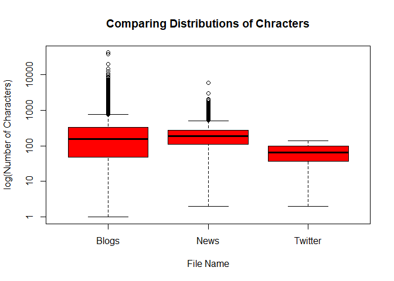
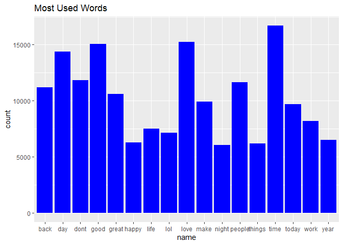
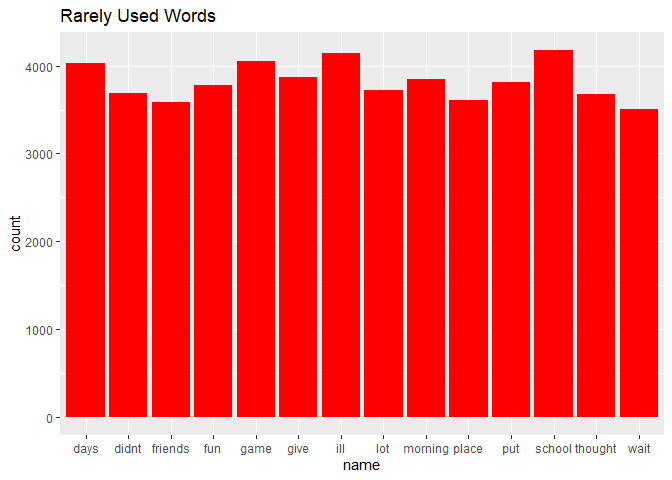
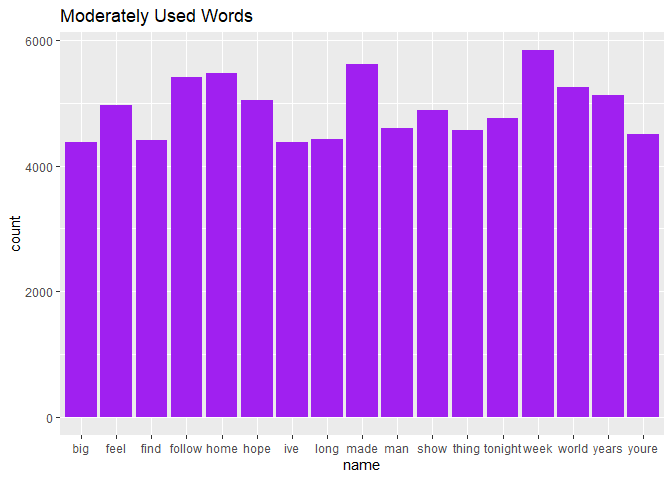

```r
knitr::opts_chunk$set(echo = TRUE, warning = FALSE, message = FALSE, cache = TRUE)
```

## Introduction

**The report** is intended to give an introductory look at analyzing the SwiftKey data set and figuring out: 

1. What the data consists.
2. Identifying the standard tools and models used for this type of data.
The report is then to be written in a clear, concise, style that a data scientist or non-data scientist can understand.

### Purpose

**The purpose of the report is :**

1. Demonstrate that the data has been downloaded from Swiftkey (via Coursera) and successfully loaded into R.

2. Create a basic report of summary statistics about the data sets to include:
  + Word counts, line counts and basic data tables,
  + Basic plots, such as histograms and pie charts, to illustrate features of the data.

3. Report any interesting findings about the data so far amassed.

4. Present the basic plan behind creating a prediction algorithm and Shiny app from the data.

### Load Data, Calculate Size, Word Count, and Summary

The Swiftkey data consists of four datasets, each in a different language (one each in German, English, Russian, and Finnish), containing random:

1. blog entries
2. news entries
3. twitter feeds

For this report, we will process the **English data**, as using all the data can take resources.

## Loading Libraries and Dataset and splitting dataset into different datasets.

**Please make sure the dataset is downloaded and extracted in your working directory. You can download the data from the link provided.**
[click to download](https://d396qusza40orc.cloudfront.net/dsscapstone/dataset/Coursera-SwiftKey.zip)


```r
library(tm)
library(ggplot2)
library(data.table)
library(ngram)
path <- file.path(getwd(), "Coursera-SwiftKey/final/en_US")
```


```r
BlogsFile   <- file.path(path, "en_US.blogs.txt")
NewsFile    <- file.path(path, "en_US.news.txt")
TwitterFile <- file.path(path, "en_US.twitter.txt")

Blogs   <- readLines(BlogsFile, encoding = "UTF-8")
News    <- readLines(NewsFile, encoding = "UTF-8")
Twitter <- readLines(TwitterFile, encoding = "UTF-8")
```

## Exploring Datasets.

### Calculating Length of the datasets

```r
LinesBlogs   <- length(Blogs)
LinesNews   <- length(News)
LinesTwitter <- length(Twitter)
LinesTotal   <- LinesTwitter + LinesBlogs + LinesNews 
```

### Calculating Number of characters in datasets.

```r
BlogsTotalChar   <- nchar(Blogs)
NewsTotalChar    <- nchar(News)
TwitterTotalChar <- nchar(Twitter)
TotalChar <- BlogsTotalChar + NewsTotalChar + TwitterTotalChar
```

### Plot to show distributions of characters in each dataset.

```r
boxplot(BlogsTotalChar, NewsTotalChar, TwitterTotalChar, log = "y",
        names = c("Blogs", "News", "Twitter"),
        ylab = "log(Number of Characters)", xlab = "File Name", col = "red") 
title("Comparing Distributions of Chracters")
```

<!-- -->

### Calculating Total Characters in each dataset.

```r
BlogsTotalCharSum   <- sum(BlogsTotalChar)
NewsTotalCharSum    <- sum(NewsTotalChar)
TwitterTotalCharSum <- sum(TwitterTotalChar)
```

### Calculating Total words in each dataset.

```r
BlogsWords <- wordcount(Blogs, sep = " ")
NewsWords  <- wordcount(News,  sep = " ")
TwitterWords <- wordcount(News, sep = " ")
```

### Calculating size of files.

```r
BlogsSize   <- file.size(BlogsFile) / (2^20)
NewsSize    <- file.size(NewsFile) / (2^20)
TwitterSize <- file.size(TwitterFile) / (2^20)
```

### Creating Data Frame of Summary of datasets.

```r
Summary <- data.frame(Files = c("Blogs", "News", "Twitter"),
                           FileSize  = c(BlogsSize, NewsSize, TwitterSize),
                           Lines = c(LinesBlogs, LinesNews, LinesTwitter),
                           TotalChar =  c(BlogsTotalCharSum, NewsTotalCharSum, TwitterTotalCharSum),
                           TotalWords = c(BlogsWords, NewsWords, TwitterWords))
Summary
```

```
##     Files FileSize   Lines TotalChar TotalWords
## 1   Blogs 200.4242  899288 206824505   37334131
## 2    News 196.2775   77259  15639408    2643969
## 3 Twitter 159.3641 2360148 162096031    2643969
```

## Taking sample from datasets and combining into one dataset.

#### Reduced Sample Size.
We will use **10%** of each data file for our reduced sample size, and create the necessary data subsets from them.

```r
PercentR = 0.1
set.seed(1239)
BlogsSize   <- LinesBlogs * PercentR
NewsSize    <- LinesNews * PercentR
TwitterSize <- LinesTwitter * PercentR

BlogsSample   <- sample(Blogs, BlogsSize)
NewsSample    <- sample(News, NewsSize)
TwitterSample <- sample(Twitter, TwitterSize)
```

### Combine the indivisual data into one data.
We will now create a corpus from the data subsets.  The tm package will help in this task. The process involves removing all non-ASCII character data, punctuation marks, excess white space, numeric data, converting the remaining alpha characters to lower case. After combining the dataset will get stored in the working directory as the text file.


```r
corpus <- c(BlogsSample, NewsSample, TwitterSample)
writeLines(corpus, "en_US.Corpus.txt")
```


## Making Corpus from sample data.

```r
corpus <- Corpus(VectorSource(corpus))
```

### Cleaning Corpus

```r
tospace <- content_transformer(function(x, pattern){ return(gsub(pattern, " ", x))})
removeURL <- function(x) gsub("http[^[:space:]]*", "", x)
corpus <- tm_map(corpus, content_transformer(removeURL))
corpus <- tm_map(corpus, removePunctuation)
corpus <- tm_map(corpus, content_transformer(tolower))
corpus <- tm_map(corpus, removeWords, stopwords("english"))
corpus <- tm_map(corpus, removeWords, stopwords("SMART"))
corpus <- tm_map(corpus, removeNumbers)
profanity <- read.table("Profanity.txt", header = FALSE, sep ="\n")
corpus <- tm_map(corpus, removeWords, profanity[,1])
corpus <- tm_map(corpus, tospace, "<.*>")
corpus <- tm_map(corpus, tospace, "#.*")
corpus <- tm_map(corpus, tospace, "www\\..*")
corpus <- tm_map(corpus, tospace, ".*\\.com")
corpus <- tm_map(corpus, tospace, "[^[:alnum:][:space:]\'\\.\\?!]")
corpus <- tm_map(corpus, tospace, "[0-9]+\\.[0-9]+")
corpus <- tm_map(corpus, tospace, "([\\.\\?!]){2,}")
corpus <- tm_map(corpus, tospace, "\\. |\\.$")
corpus <- tm_map(corpus, tospace, "\\? |\\?$")
corpus <- tm_map(corpus, tospace, "! |!$")
corpus <- tm_map(corpus, tospace, "[[:alnum:]]+\\?[[:alnum:]]+")
corpus <- tm_map(corpus, tospace, "[[:alnum:]]+![[:alnum:]]+")
corpus <- tm_map(corpus, tospace, "!")
corpus <- tm_map(corpus, tospace, "\\?")
corpus <- tm_map(corpus, tospace, "u\\.s")
corpus <- tm_map(corpus, tospace, "\\.")
corpus <- tm_map(corpus, tospace, " 's")
corpus <- tm_map(corpus, tospace, " ' ")
corpus <- tm_map(corpus, tospace, "\\\\")
corpus <- tm_map(corpus, removePunctuation)
corpus <- tm_map(corpus, stripWhitespace)
```


## Creating Document matrix and spares matrix

```r
DocTermCorpus <- DocumentTermMatrix(corpus)
dim(DocTermCorpus)
```

```
## [1] 333667 170353
```

```r
DocTermCorpus1 <- removeSparseTerms(DocTermCorpus,sparse = 0.99)
dim(DocTermCorpus1)
```

```
## [1] 333667     48
```

### Finding Terms

```r
ColSums <- colSums(as.matrix(DocTermCorpus1))
length(ColSums)
```

```
## [1] 48
```

```r
Features <- data.table(name = attributes(ColSums)$names, count = ColSums)
Features <- Features[order(count)]
```

### Some terms used in the datasets.

```r
MostUsed <- tail(Features, 10)
LeastUsed <- head(Features, 10)
MostUsed
```

```
##       name count
##  1:  today  9707
##  2:   make  9926
##  3:  great 10608
##  4:   back 11173
##  5: people 11643
##  6:   dont 11811
##  7:    day 14402
##  8:   good 15051
##  9:   love 15249
## 10:   time 16688
```

```r
LeastUsed
```

```
##        name count
##  1:    wait  3510
##  2: friends  3590
##  3:   place  3612
##  4: thought  3678
##  5:   didnt  3690
##  6:     lot  3724
##  7:     fun  3779
##  8:     put  3813
##  9: morning  3851
## 10:    give  3873
```

### **Histogram of used words in the corpus.**

### Plotting Histogram of Most Used Words.


```r
ggplot(Features[count > 6000],aes(name, count)) +
        geom_bar(stat = "identity",fill='blue') + ggtitle("Most Used Words")
```

<!-- -->

### Plotting Histogram of Least Used Words.

```r
ggplot(Features[count < 4300],aes(name, count)) +
        geom_bar(stat = "identity",fill='red') + ggtitle("Rarely Used Words")
```

<!-- -->

### Plotting Histogram of Commonly Used Words.

```r
ggplot(Features[count < 6000 & count >4300],aes(name, count)) +
        geom_bar(stat = "identity",fill='purple') + ggtitle("Moderately Used Words")
```

<!-- -->

## Project Plan
The plan is to use the initial data analysis presented here for further progress with the prediction algorithm necessary for the Shiny application **a predictive model of English text**. Way of doing this is to investigate what is possible using Markov Chains.  Further analysis will be done using **NGram modeling**, to predict next-word selection with accuracy.  All this will be presented into a user-friendly **Shiny App** that will allow the user to interact with the data and select next-word .
